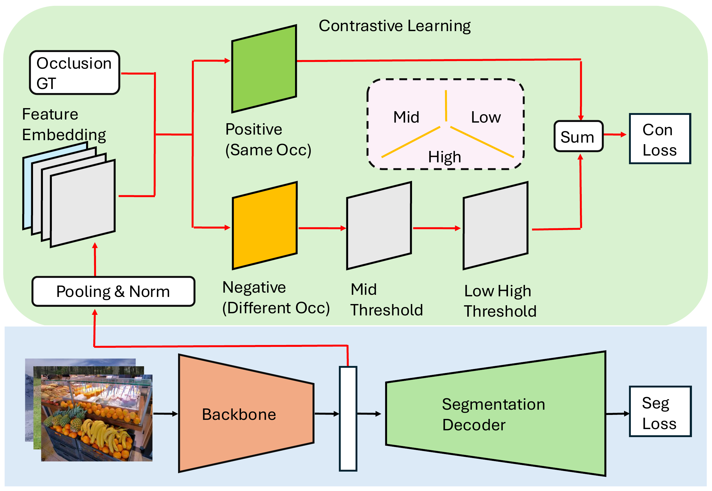

# COCO-OLAC: A Benchmark for Occluded Panoptic Segmentation and Image Understanding

[Wenbo Wei](https://github.com/wenbo-wei), [Jun Wang](https://github.com/Markin-Wang), [Abhir Bhalerao](https://scholar.google.com/citations?hl=en&user=XfBoSP4AAAAJ)

## Highlights

- **Dataset, not just a method.** COCO-OLAC is released as a benchmark — the labels, splits, and evaluation protocol are the primary deliverable.
- **Three perceived occlusion levels** annotated manually on COCO images: low (0%), mid (0–50%), high (50–100%) occlusion rate of the occluded region.
- **Per-level validation subsets** for diagnostic evaluation of any panoptic / detection / segmentation model.
- **Benchmarked under SOTA panoptic methods** (Panoptic FPN/FCN/DeepLab, MaskFormer, Mask2Former, Mask DINO), exposing a clear performance drop as occlusion rises.
- **Reference implementation** of an occlusion-aware contrastive-learning baseline included.

## Statistics

| Split          | Total  | Low   | Mid    | High   |
|:---------------|:------:|:-----:|:------:|:------:|
| Train (first 30k images of COCO `train2017`) | 30,000 | 6,668 | 11,251 | 12,081 |
| Val   (full COCO `val2017`)                          | 5,000  | 1,134 | 2,075  | 1,791  |

The validation set is also pre-split into three per-level subsets so a model can be evaluated separately on low / mid / high occlusion images.

## Download

**Occlusion-level annotations** are released **directly in this repository** at the project root:

| File                              | Size   | Contents                                              |
|:----------------------------------|:------:|:------------------------------------------------------|
| `occlusion_label_train.json`      | 802 KB | 30,000 training images, three-level labels            |
| `occlusion_label_val.json`        | 114 KB | 5,000 validation images, three-level labels           |
| `occlusion_label_val_low.json`    | 30 KB  | Val subset — low occlusion only (1,134 images)        |
| `occlusion_label_val_mid.json`    | 55 KB  | Val subset — mid occlusion only (2,075 images)        |
| `occlusion_label_val_high.json`   | 49 KB  | Val subset — high occlusion only (1,791 images)       |

**Images and panoptic masks** are *not* redistributed — please download the official **COCO 2017** images and panoptic annotations from <https://cocodataset.org/#download> and place them under `datasets/data/coco_olac/` (see [Data Preparation](#data-preparation)).

## Annotation Format

`occlusion_label_{train,val}.json` is a single JSON object mapping COCO `image_id` (zero-padded to 12 digits, string) to one of the three occlusion levels:

```json
{
  "000000432898": "high",
  "000000461009": "high",
  "000000246436": "high",
  "000000397133": "mid",
  "000000037777": "low",
  "...": "..."
}
```

Levels follow the manual annotation protocol defined in the paper (Sec. II.A):

| Level | Occluded-region rate | Meaning                                    |
|:------|:--------------------:|:-------------------------------------------|
| `low`  | 0%                   | no perceivable occlusion in the scene      |
| `mid`  | 0–50%                | partial occlusion of one or more occludees |
| `high` | 50–100%              | severe occlusion of at least one occludee  |

A small Python helper to regenerate / split labels is provided at `tools/create_eval_occl_label.py`.

## Benchmark Protocol

### Data preparation

Place the dataset under `datasets/data/`:

```
datasets/data/
└── coco_olac/
    ├── train2017/                                 # first 30k images of COCO train2017
    ├── val2017/                                   # full COCO val2017
    ├── annotations/
    │   ├── panoptic_train2017.json, panoptic_val2017.json
    │   └── panoptic_{train,val}2017/              # PNG panoptic masks
    └── occlusion_label_{train,val}.json
```

### Evaluation splits

The validation set is split by occlusion level. Each model is reported on:

- **Full val** (5,000 images) — overall metric
- **Val-Low** (1,134), **Val-Mid** (2,075), **Val-High** (1,791)

### Metrics

We report the standard panoptic metrics:

- **PQ** — Panoptic Quality (overall, *thing*, *stuff*)
- **AP<sub>pan</sub><sup>Th</sup>** — instance AP derived from panoptic predictions (thing classes)
- **mIoU<sub>pan</sub>** — semantic mIoU derived from panoptic predictions

See `tools/evaluate_pq_for_semantic_segmentation.py` and `tools/evaluate_coco_boundary_ap.py` for the evaluation utilities.

## Leaderboard

### Validation experiment (paper Table I)

Each method is evaluated **using its official pre-trained weights** on the per-level validation subsets — no retraining on COCO-OLAC.

| Method            | Occlusion | PQ   | PQ<sup>Th</sup> | PQ<sup>St</sup> | AP<sub>pan</sub><sup>Th</sup> | mIoU<sub>pan</sub> |
|:------------------|:---------:|:----:|:---------------:|:---------------:|:-----------------------------:|:------------------:|
| Panoptic FPN      | low / mid / high | 43.8 / 40.2 / 34.5 | 53.2 / 47.3 / 39.0 | 29.5 / 29.5 / 27.7 | — | — |
| Panoptic FCN      | low / mid / high | 46.9 / 44.9 / 36.3 | 56.1 / 48.2 / 40.4 | 33.3 / 32.5 / 30.1 | — | — |
| Panoptic DeepLab  | low / mid / high | 42.9 / 36.2 / 30.0 | 47.8 / 39.4 / 31.0 | 35.5 / 31.3 / 29.2 | — | — |
| MaskFormer        | low / mid / high | 52.6 / 48.0 / 41.2 | 58.3 / 53.9 / 44.0 | 43.3 / 39.1 / 37.0 | — | — |
| Mask2Former       | low / mid / high | 56.8 / 53.3 / 46.7 | 64.4 / 60.1 / 51.3 | 45.8 / 43.0 / 39.7 | 56.5 / 45.1 / 35.8 | 60.4 / 61.2 / 58.1 |
| Mask DINO         | low / mid / high | 56.6 / 53.7 / 48.3 | 63.1 / 60.6 / 53.3 | 47.0 / 43.4 / 40.8 | 56.4 / 47.2 / 38.8 | 58.0 / 59.7 / 57.4 |

Observation: PQ drops monotonically from low → high for every method — confirming the manual annotation is a meaningful difficulty signal.

### Retraining experiment (paper Table II)

Each method is **retrained on the 30k COCO-OLAC training set** under identical hyper-parameters and then evaluated on the full validation set.

| Model            | PQ   | PQ<sup>Th</sup> | PQ<sup>St</sup> | AP<sub>pan</sub><sup>Th</sup> | mIoU<sub>pan</sub> |
|:-----------------|:----:|:---------------:|:---------------:|:-----------------------------:|:------------------:|
| Panoptic FPN     | 33.3 | 39.1            | 24.6            | —                             | —                  |
| Panoptic DeepLab | 27.5 | 28.9            | 25.3            | —                             | —                  |
| Panoptic FCN     | 33.0 | 37.7            | 26.0            | —                             | —                  |
| Mask2Former      | 41.5 | 45.3            | 35.6            | 30.6                          | **54.4**           |
| YOSO             | 37.1 | 40.6            | 31.9            | —                             | —                  |
| **Ours (Mask2Former + contrastive baseline)** | **41.8** | **45.3** | **36.4** | **30.8** | 54.3 |

Want your method on the leaderboard? Open a PR with the per-level numbers and a link to the trained checkpoint.

## Reference Implementation: Contrastive Learning on Occlusion Levels

We also release a simple baseline that **uses the occlusion labels at training time**: a triplet contrastive loss that pulls same-level samples together in the backbone feature space and pushes different-level samples apart.

<p align="center"></p>

Per-level improvements over the retrained Mask2Former baseline (paper Table III):

| Occlusion | Model | PQ              | PQ<sup>Th</sup> | PQ<sup>St</sup> | AP<sub>pan</sub><sup>Th</sup> | mIoU<sub>pan</sub> |
|:---------:|:------|:---------------:|:---------------:|:---------------:|:-----------------------------:|:------------------:|
| low       | base  | 47.5            | 53.5            | 38.5            | 46.7                          | 52.2               |
|           | ours  | **48.1** (+0.6) | 53.1            | **40.8** (+2.3) | 46.4                          | **54.0** (+0.5)    |
| mid       | base  | 43.1            | 48.1            | 35.6            | 33.3                          | 54.0               |
|           | ours  | **43.2**        | 47.9            | **36.1** (+0.5) | **33.7** (+0.4)               | 54.0               |
| high      | base  | 35.7            | 38.2            | 32.0            | 24.8                          | 50.7               |
|           | ours  | **36.1** (+0.4) | 38.2            | **33.0** (+1.0) | 24.7                          | **50.8**           |

### Installation

Built on **Mask2Former** (Meta, MIT) and **detectron2**. Follow the upstream [Mask2Former installation guide](https://github.com/facebookresearch/Mask2Former/blob/main/INSTALL.md) for the heavy deps (PyTorch, detectron2, MSDeformAttn CUDA op), then:

```bash
pip install -r requirements.txt
```

<!-- TODO: write install_env.sh once env is pinned -->

### Training

```bash
bash scripts/train_conocc_olac_r50.sh
```

Uses `train_net.py` with `configs/coco_olac/panoptic-segmentation/maskformer2_R50_bs16_50ep.yaml` and the contrastive hyper-params from the paper (margins τ<sub>l,h</sub>=0.4, τ<sub>m</sub>=0.6, λ=1.0).

### Evaluation

```bash
bash scripts/eval_conocc_olac_r50.sh
```

Expects the checkpoint at `output/coco_olac/res50/con/model_final.pth`; override via `MODEL.WEIGHTS <path>`.

## Citation

If you use the COCO-OLAC dataset, please cite:

<!-- TODO: replace with the final published reference once available -->

```bibtex
@inproceedings{wei2025coco,
  title={{COCO-OLAC}: A Benchmark for Occluded Panoptic Segmentation and Image Understanding},
  author={Wei, Wenbo and Wang, Jun and Bhalerao, Abhir},
  booktitle={ICASSP 2025-2025 IEEE International Conference on Acoustics, Speech and Signal Processing (ICASSP)},
  pages={1--5},
  year={2025},
  organization={IEEE}
}
```

## Acknowledgements

COCO-OLAC is built on top of the following open-source projects and datasets:

- [COCO](https://cocodataset.org) — source images and original panoptic annotations.
- [Mask2Former](https://github.com/facebookresearch/Mask2Former) (Meta, MIT) — panoptic segmentation framework. Modified portions retain the original Meta copyright headers.
- [detectron2](https://github.com/facebookresearch/detectron2) (Meta, Apache 2.0) — training engine and data loading.
- [Deformable DETR](https://github.com/fundamentalvision/Deformable-DETR) (SenseTime, Apache 2.0) — MSDeformAttn CUDA op used by Mask2Former.

We thank the authors of these works for releasing their code and data.

## License

Code: [](LICENSE)

Annotations: released under the same license as the underlying COCO images (Creative Commons Attribution 4.0). <!-- TODO: confirm CC-BY-4.0 is the intended license for the new labels -->
